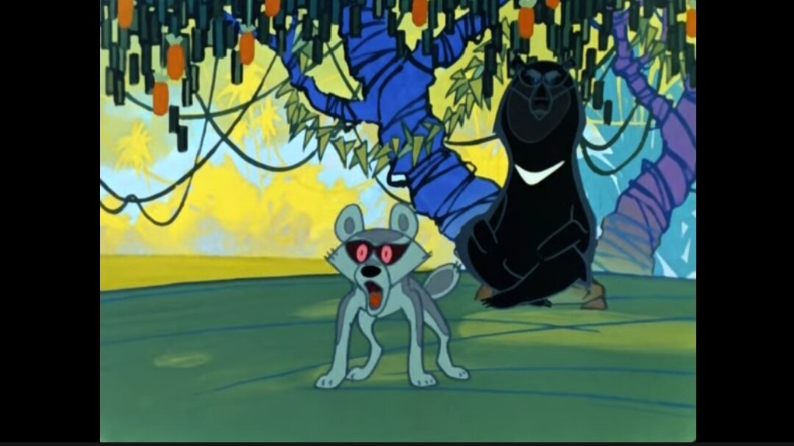
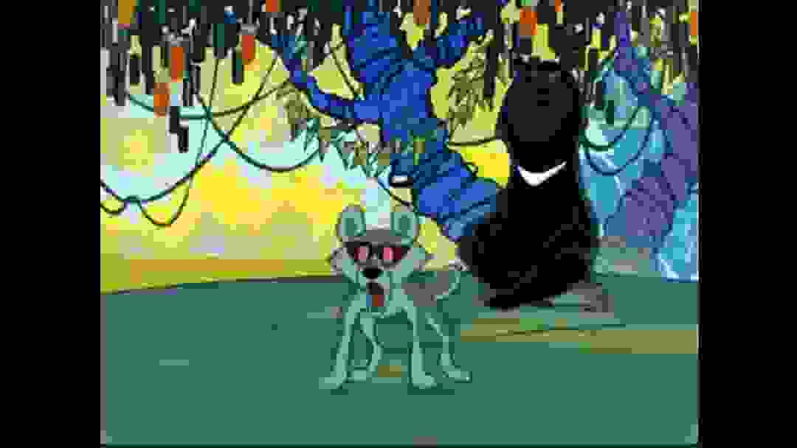

# jackal9000

I've been looking for a simple program to jackalize images, but haven't found one. So here it is.

Supports: jpeg, png.

Usage: ./jackal9000 IMAGE_PATH [OPTIONAL QUALITY 0-10, DEFAULT 8]

### Example:

```cmd
.\jackal9000.exe .\1.jpeg 0
```

### Before:



### After:


